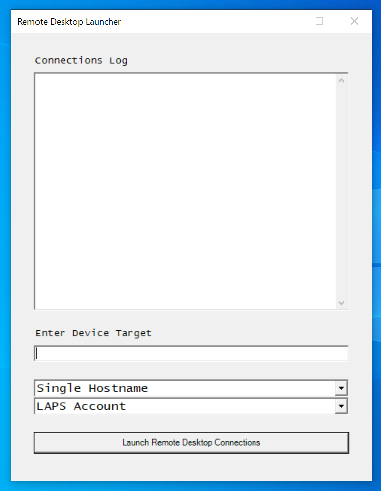

# RDP-Launcher
GUI tool to mass launch remote desktop sessions from a CSV of DNS Hostnames or an MECM Device Collection. Single login with SYS account or automated local admin with LAPS solution.

## Installation
1. ConfigurationManager PowerShell module is required for import.
2. Download files to the same directory.
3. The scripts are unsigned, so you may have to edit/save the scripts locally before running.
4. Set $LocalUserAccount and $MaxSyncSessions at the top of "Remote Desktop Launcher.ps1" file  and save.
4. Run the installation script as "Administrator"

## How to Use
1. Launch the tool from the desktop shortcut.
2. Enter computer hostname, MECM device collection (exact name), or full path to CSV (no heading, simple hostnames list).
3. Select desired options from the drop down (type of computer list, SYS or LAPS logon).
4. Click the launch button or hit the return key.
5. If prompted, enter SYS account credentials.
6. Remember to sign-out of RDP sessions instead of just closing, because who wants to leave 1,000 computers with logged in sessions? :)

Note: Written and tested with PowerShell 5.1

Sanitized Screenshot:

